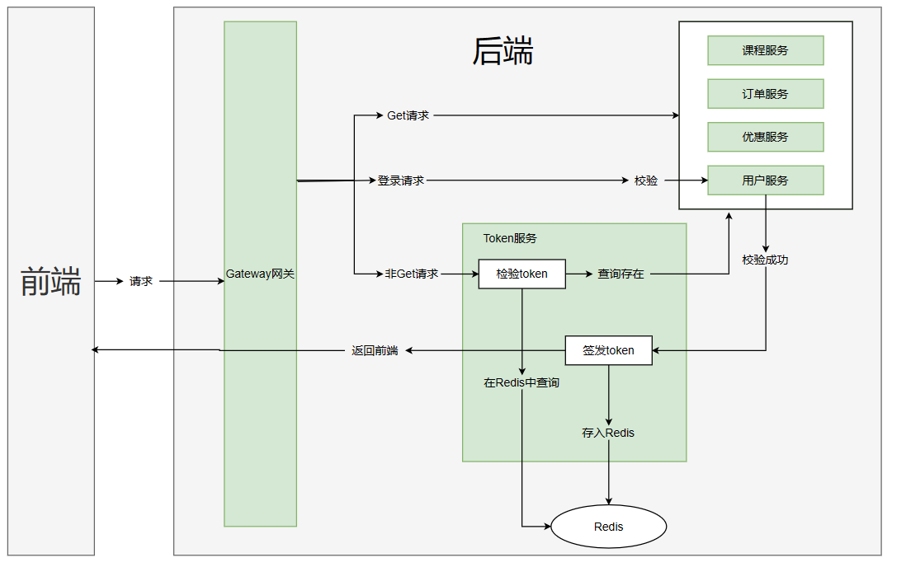

# 谷粒课堂微服务项目
## 项目环境

Java：17

Maven：3.6

MySQL：8.0

Redis：6.2

Spring Boot：3.0.1

Spring Cloud：2022.0.1

## 项目架构

### 整体架构



### 项目目录

```
/grain-class
	/client
		/client-token  	token服务的远程调用接口
		/client-user	user服务的远程调用接口
	/common
		/service-utils	一些工具类
	/service
		/service-active	优惠服务
		/service-order	订单服务
		/service-token	token服务
		/service-user	用户服务
		/service-vod	课程
	/service-gateway
```

### 项目功能

+ `RustFul`风格的增删改查功能
+ 使用`MybatisPlus`的**分页条件查询**
+ 使用`Nacos`的服务注册与服务配置

## SpringBoot3与SpringCloud2022

